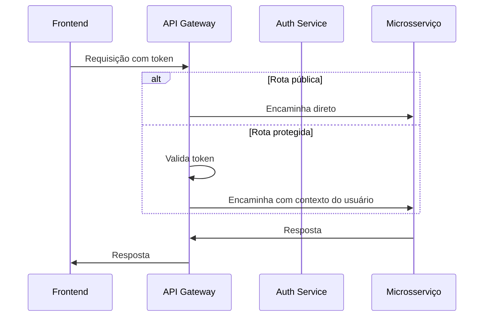
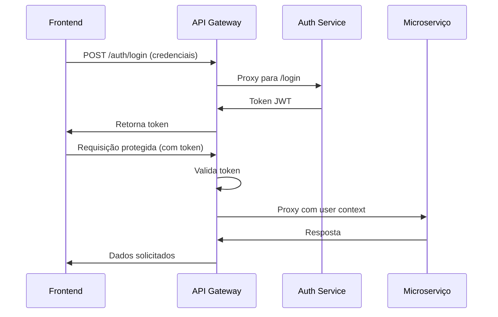
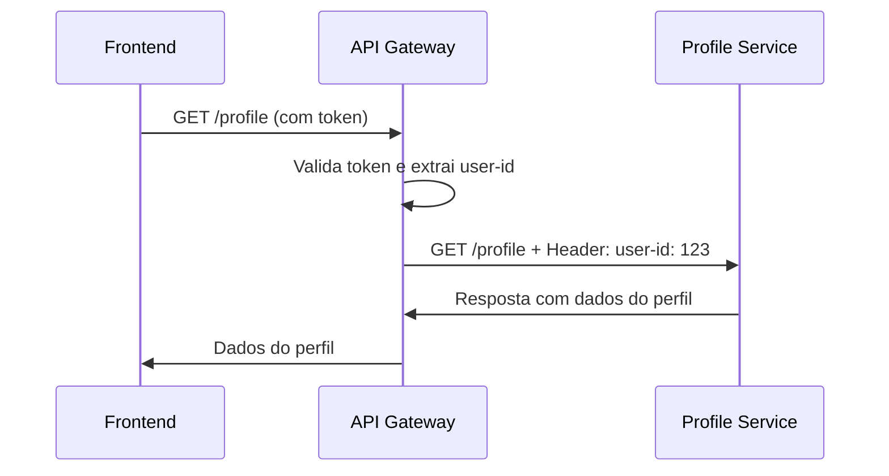

# API Gateway - Microservices Architecture

Este é um **API Gateway** desenvolvido com **Node.js** e **Express**, responsável por rotear requisições entre diferentes microserviços, centralizar autenticação via JWT e gerenciar CORS e logging.

## 🚀 Funcionalidades

- Proxy reverso para microserviços 
    - Esconde os servidores internos do cliente
    - Cliente → Proxy → Servidores internos
- Middleware global de autenticação com JWT
- Repasse de contexto do usuário para serviços específicos
- Rotas públicas configuráveis
- Gerenciamento de CORS
- Logging de requisições via `morgan`
- Tratamento de erros quando os serviços estão indisponíveis

---

## 📦 Instalação

1. **Clone o repositório:**

```bash
git clone https://github.com/Nyfeu/Cookster.git
cd back/api-gateway
```

2. **Instale as dependências:**
```bash
npm install
```

3. **Crie um arquivo `.env` na raiz do projeto com o seguinte conteúdo:

```plain-text
JWT_SECRET=chave_secreta
```

## 🔧 Estrutura dos Microserviços

> Ainda será atualizada para cobrir todos os microserviços do sistema

| Serviço    | Porta | Descrição                             | Requer user-id? |
| ---------- | ----- | ------------------------------------- |---------------- |
| Auth       | 3000  | Serviço de autenticação               | ❌ Não         |
| Debug      | 7000  | Serviço para debug da API Gateway     | ✅ Sim         |
| Ingredient | 8000  | Serviço de autocomple de ingredientes | ❌ Não         |

## 🌐 Rotas

### 🔑 Rotas Públicas



Definidas diretamente na lista services:
```javascript
const services = {
  auth: {
    target: 'http://localhost:3000',
    publicRoutes: ['/register', '/login']
  },
  ingredient: {
    target: 'http://localhost:8000',
    publicRoutes: ['/health']
  }
};
```

Exemplos de rotas públicas:
- POST `/auth/login`
- POST `/auth/register`
- GET `/ingredient/health`

### 🔒 Rotas Protegidas

Todas as demais rotas exigem um token JWT no header:
```http
Authorization: Bearer <seu_token>
```

> A proteção de rotas é essencial não apenas para garantir segurança, mas também para mitigar sobrecarga em serviços sensíveis e computacionalmente dispendiosos, como mecanismos de busca ou autocomplete de ingredientes, que são altamente suscetíveis a picos de acesso.



Exemplo:
- GET `/ingredient/suggestion...`

## 🔄 Repasse de Contexto do Usuário

Para serviços que necessitam do identificador do usuário (como o serviço de perfil), o gateway adiciona o `user-id` extraído do token JWT no header da requisição que é repassada ao microserviço.

### Configuração por Serviço
Cada serviço pode ser configurado com a propriedade `requiresUserId`:
```javascript
const services = {
  // ...
  profile: {
    target: 'http://localhost:7000',
    requiresUserId: true // Indica que o user-id será repassado
  },
  // ...
};
```

### Funcionamento

1. O gateway valida o token JWT e extrai o payload
2. Se o serviço de destino tiver requiresUserId: true, o gateway adiciona um header `user-id` através do proxy
3. O microserviço recebe a requisição com o contexto do usuário



### Vantagens

1. **Desacoplamento**: Os serviços não precisam acessar o token JWT
2. **Segurança**: Reduz exposição de dados sensíveis
3. **Performance**: Evita repetidas validações de token
4. **Simplicidade**: Microserviços consomem ID diretamente

## ▶️ Executando o Gateway

```bash
npm run devStart
```

O gateway estará disponível em:
```plain-text
http://localhost:2000
```

## 🗺️ Exemplo de Requisição com Token

```plain-text
GET /ingredient/sugestoes?termo=ban HTTP/1.1
Host: localhost:2000
Authorization: Bearer <seu_token_aqui>
```
> Sem as angle brackets (<>) e sem aspas (")

## 🧠 Observações

- As rotas são automaticamente roteadas para os microserviços correspondentes. Por exemplo:
    - `/auth/login` → `http://localhost:3000/login`
    - `/ingredient/health` → `http://localhost:8000/health`
- O middleware de autenticação protege todas as rotas, exceto aquelas declaradas como públicas.

## 🛠️ Tecnologias Utilizadas

- Node.js
- Express.js
- http-proxy-middleware
- jsonwebtoken
- dotenv
- cors
- morgan
