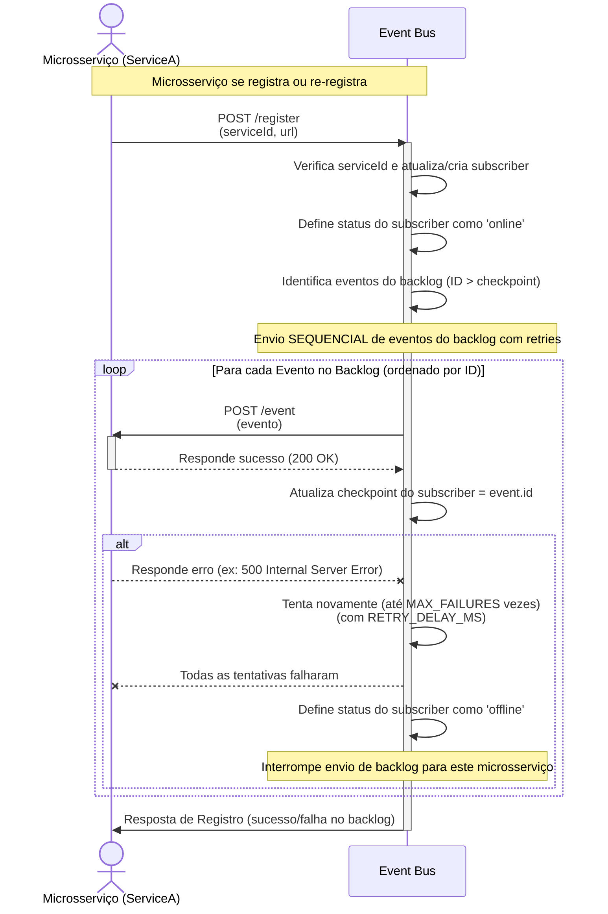
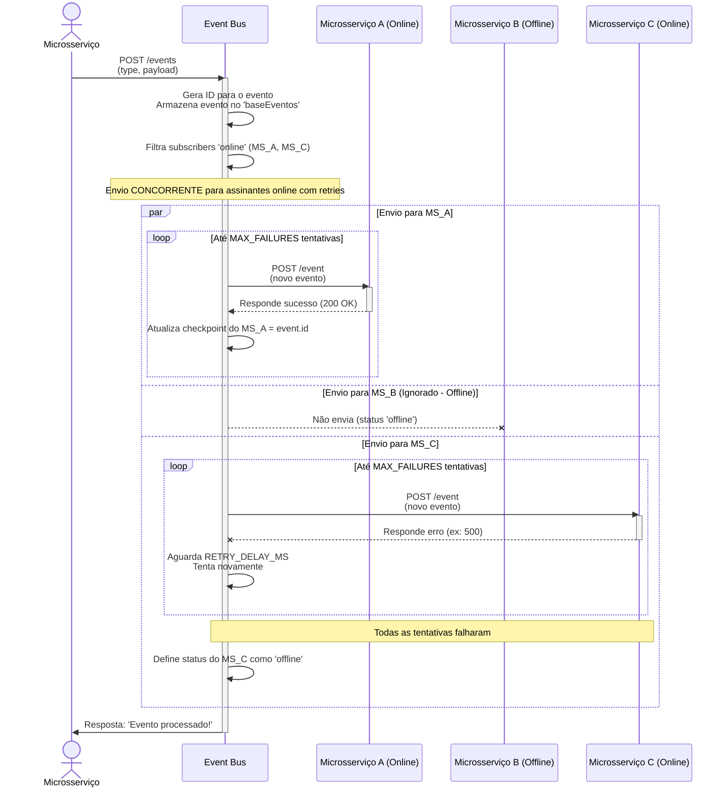

# 🚌 Event Bus

Este projeto é um **barramento de eventos (Event Bus)** desenvolvido em **Node.js** usando **Express** e **Axios**. Ele permite que diferentes serviços em uma arquitetura de microserviços se comuniquem de forma assíncrona, através de eventos publicados e distribuídos.

---

## 📦 Funcionalidades

- Registro dinâmico de serviços para receber eventos.
- Mecanismo de Event-Checkpoint - permitindo que serviços se inteirem de eventos ocorridos antes de serem registrados ou enquanto estiveram offline.
- Gerenciamento de status de serviço - o status de serviços é alterado para "online" ou "offline".
- Redistribuição de eventos recebidos para todos os serviços registrados.
- Retry Confiável, onde, ocorrem tentativas automáticas de reenvio de eventos para garantir a entrega, mesmo em falhas temporárias.
- Histórico de todos os eventos recebidos.
- API para listar serviços registrados (com seus status e checkpoints) e eventos armazenados.

---

## 🚀 Como executar

### 1. Clonar o repositório

```bash
git clone https://github.com/Nyfeu/Cookster.git
cd back/event-bus
```

### 2. Instalar as dependências

```bash
npm install
```

### 3. Iniciar o barramento

```bash
npm run devStart
```

## 📡 Endpoints 

### `POST /register`

> Registra um novo serviço para receber eventos ou re-registra um serviço existente. Ao registrar, o serviço tentará sincronizar seu backlog de eventos.

- Corpo da requisição
```json
{
    "serviceId": "nome-do-serviço",
    "url": "http://localhost:5000/events"
}
```

- Resposta
```json
{ 
    "status": "Registrado com sucesso!" 
}
```json
{
    "status": "Registrado com sucesso e X eventos do backlog enviados!"
}
```json
{
    "status": "Registrado, mas falha ao enviar todos os eventos do backlog. Serviço 'nome-do-serviço  ' offline."
}

```



### `POST /events`

> Envia um novo evento para ser distribuído aos serviços registrados.

- Corpo da requisição:
```json
{
    "type": "ExemploEvento",
    "data": {
        "id": 1,
        "mensagem": "Olá, mundo!"
    }
}
```

- Resposta:
```json
{ 
    "status": "Evento processado!" 
}
```

> ⚠️ **Mecanismo de Retry e Status**: Quando um evento é distribuído, o Event Bus tenta entregá-lo MAX_FAILURES vezes. Se todas as tentativas falharem, o serviço de destino terá seu status alterado para offline.



### `GET /subscribers`

> Retorna a lista de serviços registrados, incluindo seus serviceId, url, checkpoint e status (online ou offline).

- Exemplo de resposta:

```json
[
  {
    "serviceId": "serviceA",
    "url": "http://localhost:4001/events",
    "checkpoint": 5,
    "status": "online"
  },
  {
    "serviceId": "serviceB",
    "url": "http://localhost:4002/events",
    "checkpoint": 2,
    "status": "offline"
  }
]
```

### `GET /events`

> Retorna o histórico de todos os eventos processados.

Exemplo de resposta:
```json
{
  "events": [
    {
      "id": 0,
      "type": "ExemploEvento",
      "payload": { "id": 1, "mensagem": "Olá, mundo!" }
    },
    {
      "id": 1,
      "type": "OutroEvento",
      "payload": { "dados": "..." }
    }
  ]
}
```

## ⚙️ Configurações internas

- `MAX_FAILURES = 3`: número máximo de tentativas para entregar um único evento. Se todas as tentativas falharem, o serviço é considerado offline.
- `RETRY_DELAY_MS = 200`: tempo de espera (em milissegundos) entre as tentativas de reenvio de um evento.
- `subscribers`: mapa em memória dos serviços registrados.
- `baseEventos`: lista em memória com todos os eventos processados (backlog).

## 🧪 Exemplo de uso com outros serviços

Pode-se iniciar múltiplos serviços que expõem o endpoint /event e registrá-los neste barramento para receber notificações sempre que um novo evento for publicado. O trecho abaixo demonstra como realizar o registro automaticamente após a inicialização do serviço:

```javascript
const axios = require('axios'); 

app.listen(port, async () => {
  console.log(`Microsserviço (localhost:${port}): [OK]`);

  try {

    // A URL deve apontar para o endpoint que o Event Bus usará para enviar eventos
    await axios.post(`http://localhost:4000/register`, { 
        serviceId: 'seu-id-do-servico', 
        url: `http://localhost:${port}/events` 
    });

    console.log(`Registro no Event Bus (http://localhost:${port}): [OK]`);

  } catch (error) {

    console.error(`Registro no Event Bus (http://localhost:${port}): [FALHOU]`, error.message);

  }

});
```