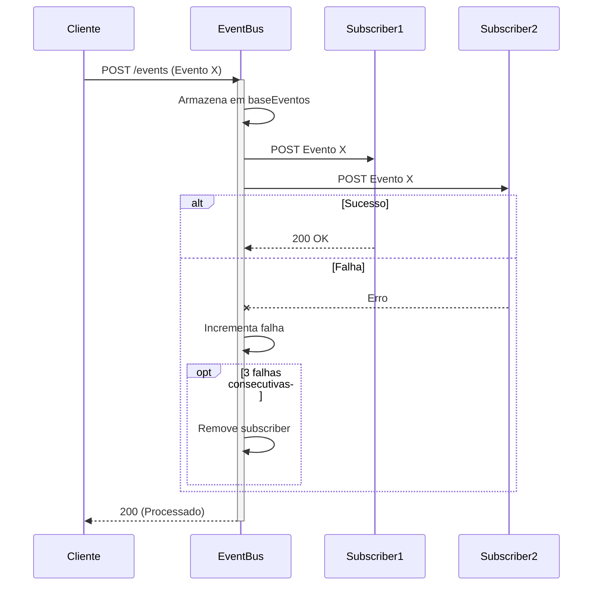

# 🚌 Event Bus

Este projeto é um **barramento de eventos (Event Bus)** simples desenvolvido em **Node.js** usando **Express**. Ele permite que diferentes serviços em uma arquitetura de microserviços se comuniquem de forma assíncrona, através de eventos publicados e distribuídos.

---

## 📦 Funcionalidades

- Registro dinâmico de serviços para receber eventos.
- Redistribuição de eventos recebidos para todos os serviços registrados.
- Mecanismo de tolerância a falhas com remoção de serviços instáveis.
- Histórico de todos os eventos recebidos.
- API para listar serviços registrados e eventos armazenados.

---

## 🚀 Como executar

### 1. Clonar o repositório

```bash
git clone https://github.com/Nyfeu/Cookster.git
cd back/event-bus
```

### 2. Instalar as dependências

```bash
npm install
```

### 3. Iniciar o barramento

```bash
npm run devStart
```

## 📡 Endpoints 

### `POST /register`

> Registra um novo serviço para receber eventos.

- Corpo da requisição
```json
{
    "url": "http://localhost:5000/events"
}
```

- Resposta
```json
{ 
    "status": "Registrado com sucesso!" 
}
```

### `POST /events`

> Envia um novo evento para ser distribuído aos serviços registrados.

- Corpo da requisição:
```json
{
    "type": "ExemploEvento",
    "data": {
        "id": 1,
        "mensagem": "Olá, mundo!"
    }
}
```

- Resposta:
```json
{ 
    "status": "Evento processado!" 
}
```

> ⚠️ Caso algum serviço falhe 3 vezes consecutivas no recebimento de eventos, ele será removido da lista de assinantes.



### `GET /subscribers`

> Retorna a lista de URLs dos serviços registrados.

- Exemplo de resposta:

```json
[
  "http://localhost:5000/events",
  "http://localhost:6000/events"
]
```

### `GET /events`

> Retorna o histórico de todos os eventos processados.

Exemplo de resposta:
```json
{
  "events": [
    {
      "type": "ExemploEvento",
      "data": { "id": 1, "mensagem": "Olá, mundo!" }
    }
  ]
}
```

## ⚙️ Configurações internas

- `MAX_FAILURES = 3`: número máximo de falhas antes de um serviço ser removido.
- `subscribers`: lista em memória dos serviços registrados.
- `failures`: contador de falhas por serviço.
- `baseEventos`: lista em memória com todos os eventos processados.

## 🧪 Exemplo de uso com outros serviços

Pode-se iniciar múltiplos serviços que expõem o endpoint /events e registrá-los neste barramento para receber notificações sempre que um novo evento for publicado. Assim como, pode-se utilizar o seguinte trecho para realizar o registro automaticamente após a inicialização do serviço:

```javascript
app.listen(port, async () => {

  console.log(`mss (localhost:${port}): [OK]`)

  try {
    await axios.post(`http://localhost:${event_bus_port}/register`, { url: `http://localhost:${port}` });
    console.log(`Event Bus Registration (http://localhost:${port}): [OK]`);
  } catch (error) {
    console.error(`Event Bus Registration (http://localhost:${port}): [FAILED]`, error.message);
  }

})
```