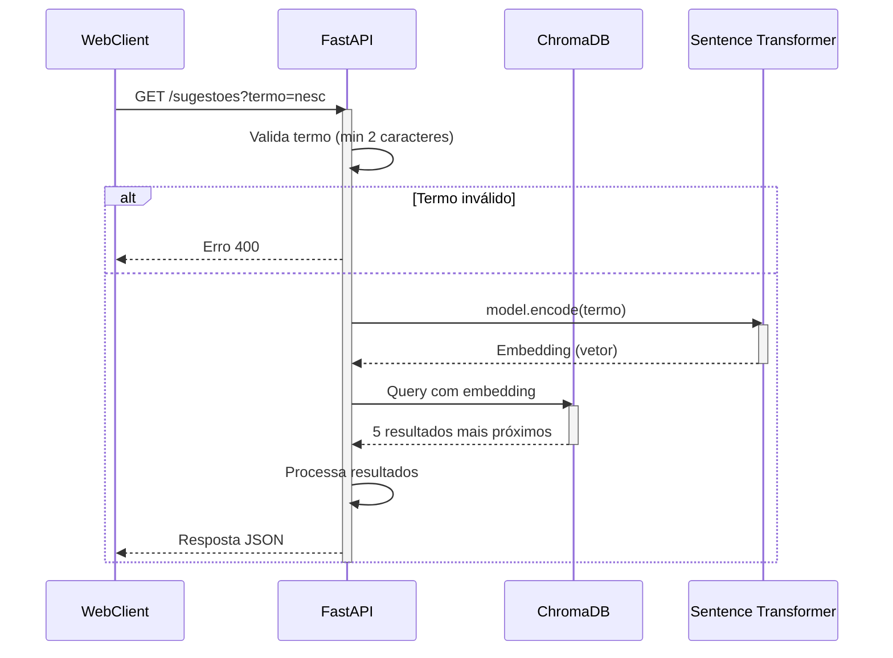

# 🍳 Microsserviço: IngredientClassifier

Microsserviço para sugestão/autocomplete de ingredientes culinários usando busca em banco de dados vetorial.

## ✨ Funcionalidades Principais
- Busca por similaridade
- Sugestão de 5 ingredientes por consulta
- Persistência de dados com ChromaDB
- Modelo de embeddings `all-MiniLM-L6-v2`
- Health check automático
- Configuração via ambiente

## ⚙️ Instalação

### Pré-requisitos
- Python 3.10+
- Pip

### Passos
1. Clone o repositório:
```bash
git clone https://github.com/Nyfeu/Cookster.git
cd back/mss-ingredient-classifier
```

2. Crie e ative o ambiente virtual:
```bash
python -m venv .venv
source .venv/bin/activate  # Linux/Mac
.venv\Scripts\activate     # Windows
```

3. Instale as dependências:
```bash
pip install -r requirements.txt
```

## 🔧 Configuração

1. Crie o arquivo `.env`:
```ini
EMBEDDING_MODEL="all-MiniLM-L6-v2"
CHROMA_DB_PATH="./data/chroma"
CORS_ORIGINS="http://localhost:3000"
```

2. Estruture o `data/ingredientes.json`:
```json
[
    {
        "nome": "Achocolatado em Pó",
        "sinonimos": ["Nescau", "Toddy", "chocolate em pó"]
    },
    {
        "nome": "Leite",
        "sinonimos": ["leite integral", "leite desnatado"]
    }
]
```

## ▶️ Execução

**Modo desenvolvimento:**
```bash
uvicorn script:app --reload
```

**Modo produção:**
```bash
uvicorn script:app --host 0.0.0.0 --port 8000 --workers 4
```

## 📡 Endpoints

### 1. Buscar Sugestões
```http
GET /sugestoes?termo={termo}
```



**Parâmetros:**
- `termo`: Texto para busca (mín. 2 caracteres)

**Exemplo:**
```bash
curl "http://localhost:8000/sugestoes?termo=nesc"
```

**Resposta de Sucesso:**
```json
{
    "termo": "nesc",
    "sugestoes": ["Achocolatado em Pó", "Leite em Pó"],
    "count": 2
}
```

### 2. Verificar Saúde
```http
GET /health
```

**Resposta:**
```json
{
    "status": "online",
    "details": {
        "model": "all-MiniLM-L6-v2",
        "db_status": "ok",
        "total_ingredientes": 25
    }
}
```

## 🚀 Exemplos de Uso

### Request
```bash
curl "http://localhost:8000/sugestoes?termo=leite"
```

### Response
```json
{
    "termo": "leite",
    "sugestoes": ["Leite", "Leite Condensado", "Leite de Coco"],
    "count": 3
}
```

### Erro Comum
```bash
curl "http://localhost:8000/sugestoes?termo=a"
```
```json
{
    "detail": "Digite pelo menos 2 caracteres"
}
```

## ❓ FAQ

**Q: Como adicionar novos ingredientes?**  
A: Edite o `ingredientes.json`, delete a pasta `data/chroma` e reinicie o serviço.

**Q: O .env não está carregando?**  
Verifique:
- Arquivo na raiz do projeto
- Nome exato `.env`

**Q: Problemas de CORS?**  
Atualize `CORS_ORIGINS` no `.env` com a URL frontend.
